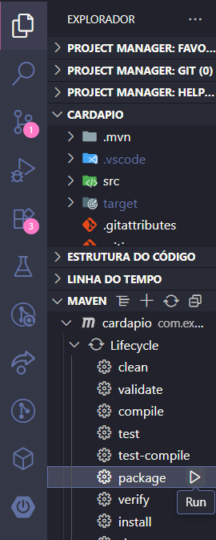

# Cardápio Online Back-End


Projeto feito com apoio do curso de full-stack da [Fernanda Kipper](https://github.com/Fernanda-Kipper/backend-cardapio-digita), o Back-End do projeto foi feito com Java Spring Boot e o banco em Postgres.

**[Vídeo da Fernanda Kipper](https://youtu.be/lUVureR5GqI?si=DBdN6epsp39k38uX)**

**[Link do reposítorio Front-End](https://github.com/Carlos-bonfim26/frontend-cardapio-digital)**
## Instalação do projeto

É necessário que tenha instalado o Java.

Para clonar o repositório:
```bash
git clone https://github.com/Carlos-bonfim26/backend-cardapio-digital
```
E para instalar as depêndencias é preciso rodar o package com maven

